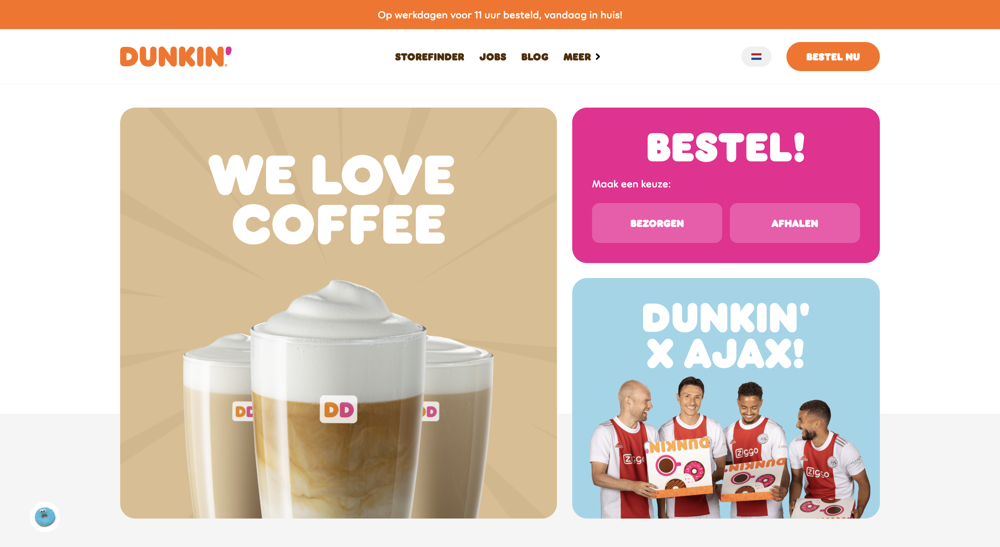
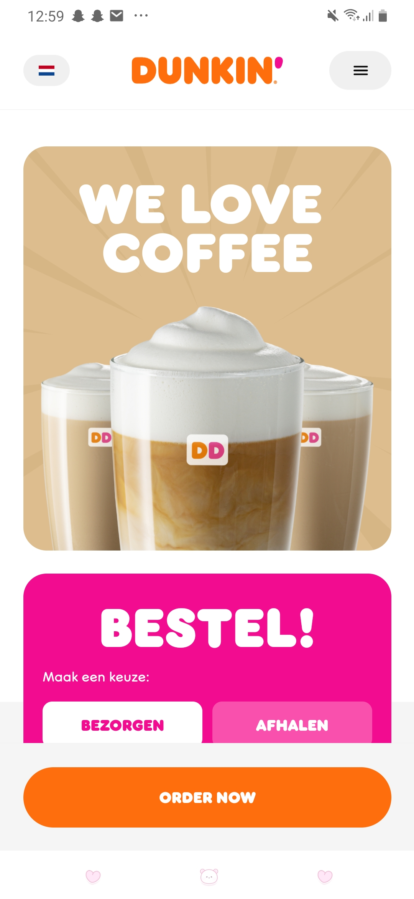

# Procesverslag
Markdown is een simpele manier om HTML te schrijven.  
Markdown cheat cheet: [Hulp bij het schrijven van Markdown](https://github.com/adam-p/markdown-here/wiki/Markdown-Cheatsheet).

Nb. De standaardstructuur en de spartaanse opmaak van de README.md zijn helemaal prima. Het gaat om de inhoud van je procesverslag. Besteedt de tijd voor pracht en praal aan je website.

Nb. Door *open* toe te voegen aan een *details* element kun je deze standaard open zetten. Fijn om dat steeds voor de relevante stuk(ken) te doen.

## Jij

  
uitwerken voor kick-off werkgroep

  ### Auteur:
  Soraya Woest 

  #### Je startniveau:
  Blauw en misschien rood (kies uit zwart, rood óf blauw)

  #### Je focus:
  Responsive (kies uit responsive óf surface plane)
 

## Je website

  
uitwerken voor kick-off werkgroep

  ### Je opdracht:
  link naar de website die je gaat namaken óf de naam/omschrijving van je eigen ontwerp
  Dunkin donuts
  https://www.dunkin.nl/

  #### Screenshot(s) van de eerste pagina (small screen): 
  voorbeeld plaatje
  

  Home pagina
   
   

  #### Screenshot(s) van de tweede pagina (small screen):
  voorbeeld plaatje
  

  Blog pagina
  
  
 

## Toegankelijkheidstest 1/2 (week 1)

  
uitwerken na test in 1e werkgroep

  ### Bevindingen
  Lijst met je bevindingen die in de test naar voren kwamen:
  - De screenreader leest een knop heel raar (van de vlag)
  - De screenreader lijst met links en headers kloppen niet helemaal. Er staat heel vaak "winkels
    dunkin komt naar riel"
  - De screenreader doet het in het algemeen best goed
  FOTO'S VAN TEST

  - Bij tab is het minimaal vormgegeven en valt het niet goed op
  - onder aan de home pagine tript de blogs. Het krijgt een paar keer geen blauwe rand en dan wel (het gaat vaak 
  opnieuw)
  SCREENSHOTS

  - kleuren opdracht, blurred is niet te zien
  - De rest is echt goed zichtbaar
  SCREENSHOTS

  - Bril - central field loss, kleine letterypen is moeilijk te lezen, licht grijs is niet te lezen.
  - Spasmes Parkinson - Moeilijk te navigeren met touchbar
  - elastiek - moeilijk telefoon vasthouden

  DOE OVERAL FOTOS EN VUL DE REST IN

  #### Screenreader
  Hier korte omschrijving (met indien nodig afbeeldingen)
  Om de toegankelijkheid te testen van Dunkin had ik op me macbook de screenreader gebruikt. AFBEELDING

  Hier een omschrijving van hoe het opgelost kan worden (met indien nodig afbeeldingen)
  - De knop met de vlag zo coderen dat de screenreader het beter leest
  - Onder aan de pagina ga ik de lijst beter coderen zodat de screenreader het in 1 keer pakt

  #### Muis en Toetsenbord 
  Hier korte omschrijving (met indien nodig afbeeldingen)
  Vervolgens ging ik de dunkin site testen met met mijn toetsenbord en dan met de toets "tab".
  Ik ging dan door de website heen tabben en kijken wat hij oppakt en of dat wel duidelijk genoeg is.

  Hier een omschrijving van hoe het opgelost kan worden (met indien nodig afbeeldingen)
  - Beter vormegeven (CSS)

  #### Motoriek (shocks, elastiekjes)
  Hier korte omschrijving (met indien nodig afbeeldingen)
  Bij motoriek heb ik gebruik gemaakt van zowel elastiekjes en de spasmes parkinson. Op die manier kon ik dus zelf meemaken hoe
  het is om bijvoorbeeld spasme te hebben.

  Hier een omschrijving van hoe het opgelost kan worden (met indien nodig afbeeldingen)
  - 

  #### Visueel (brillen, contrast, kleurenblind, dark/light). 
  Hier korte omschrijving (met indien nodig afbeeldingen)
  Voor visueel heb ik mijn website getest voor kleurenblind en had ik ook de central field bril op gedaan. 

  Hier een omschrijving van hoe het opgelost kan worden (met indien nodig afbeeldingen)
  - Toen ik de bril op had waren de kleine/licht grijze letters moeilijk te lezen.

## Breakdownschets (week 1)

  
uitwerken na afloop 2e werkgroep

  ### de hele pagina: 
  

  ### dynamisch deel (bijv menu): 
  

  ### wellicht nog een dynamisch deel (bijv filter): 
  

## Voortgang 1 (week 2)

  
uitwerken voor 1e voortgang

  ### Stand van zaken
  Dit ging goed:
  - De eerste 2 blokken gingen met veel moeite uiteindelijk wel goed! de foto is goed terecht gekomen
  en een leuke achtergrond met behulp van CSS.
  - De header is sticky!
  

  Dit ging lastig:
  - Ik was hier heel lang mee bezig, de foto wilt maar niet in het midden komen!
  

  - De list items willen maar niet uitelkaar
  

  ### Agenda voor meeting
  samen met je groepje opstellen

  1. Koen:
  - Vraag over categorieen
  - Vraag over opdracht wel of niet beter maken

  2. Soraya:
  - Vraag over de foto die niet in het midden kan
  - Vraag over OL

  ### Verslag van meeting
  hier na afloop snel de uitkomsten van de meeting vastleggen

  - punt 1
  - punt 2
  - nog een punt
  - ...

## Voortgang 2 (week 3)

  
uitwerken voor 2e voortgang

  ### Stand van zaken
  hier dit ging goed & dit was lastig (neem ook screenshots op van delen van je website en code)

  ### Agenda voor meeting
  samen met je groepje opstellen

  | student 1      | student 2          | student 3    | student 4        |
  | ---            | ---                | ---          | ---              |
  | dit bespreken  | en dit             | en ik dit    | en dan ik dat    |
  | en dat ook nog | dit als er tijd is | nog een punt | dit wil ik zeker |
  | ...            | ...                | ...          | ...              |

  ### Verslag van meeting
  hier na afloop snel de uitkomsten van de meeting vastleggen

  - punt 1
  - punt 2
  - nog een punt
- ...

## Toegankelijkheidstest 2/2 (week 4)

  
uitwerken na test in 8e werkgroep

  ### Bevindingen
  Lijst met je bevindingen die in de test naar voren kwamen (geef ook aan wat er verbeterd is):

  #### Screenreader
  Hier korte omschrijving (met indien nodig afbeeldingen)

  Hier een omschrijving van hoe het opgelost kan worden (met indien nodig afbeeldingen)

  #### Muis en Toetsenbord 
  Hier korte omschrijving (met indien nodig afbeeldingen)

  Hier een omschrijving van hoe het opgelost kan worden (met indien nodig afbeeldingen)

  #### Motoriek (shocks, elastiekjes)
  Hier korte omschrijving (met indien nodig afbeeldingen)

  Hier een omschrijving van hoe het opgelost kan worden (met indien nodig afbeeldingen)

  #### Visueel (brillen, contrast, kleurenblind, dark/light). 
  Hier korte omschrijving (met indien nodig afbeeldingen)

  Hier een omschrijving van hoe het opgelost kan worden (met indien nodig afbeeldingen)

## Voortgang 3 (week 4)

  
uitwerken voor 3e voortgang

  ### Stand van zaken
  hier dit ging goed & dit was lastig (neem ook screenshots op van delen van je website en code)

  ### Agenda voor meeting
  samen met je groepje opstellen

  | student 1      | student 2          | student 3    | student 4        |
  | ---            | ---                | ---          | ---              |
  | dit bespreken  | en dit             | en ik dit    | en dan ik dat    |
  | en dat ook nog | dit als er tijd is | nog een punt | dit wil ik zeker |
  | ...            | ...                | ...          | ...              |

  ### Verslag van meeting
  hier na afloop snel de uitkomsten van de meeting vastleggen

  - punt 1
  - punt 2
  - nog een punt
  - ...

## Eindgesprek (week 5)

  
uitwerken voor eindgesprek

  ### Je uitkomst - karakteristiek screenshots:
  

  ### Dit ging goed/Heb ik geleerd: 
  Korte omschrijving met plaatjes

  

  ### Dit was lastig/Is niet gelukt:
  Korte omschrijving met plaatjes

  

## Bronnenlijst

  
continu bijhouden terwijl je werkt

  Nb. Wees specifiek ('css-tricks' als bron is bijv. niet specifiek genoeg).

  1. bron 1
  2. bron 2
  3. ...

