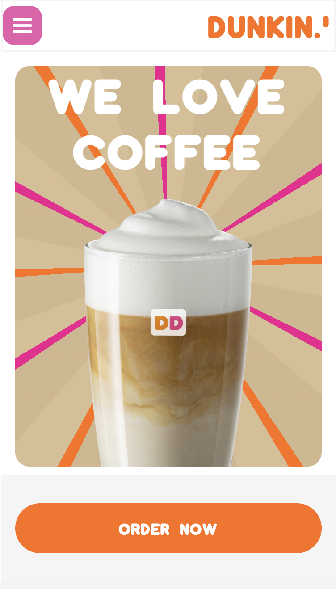

# Procesverslag
Markdown is een simpele manier om HTML te schrijven.  
Markdown cheat cheet: [Hulp bij het schrijven van Markdown](https://github.com/adam-p/markdown-here/wiki/Markdown-Cheatsheet).

Nb. De standaardstructuur en de spartaanse opmaak van de README.md zijn helemaal prima. Het gaat om de inhoud van je procesverslag. Besteedt de tijd voor pracht en praal aan je website.

Nb. Door *open* toe te voegen aan een *details* element kun je deze standaard open zetten. Fijn om dat steeds voor de relevante stuk(ken) te doen.

## Jij

  
uitwerken voor kick-off werkgroep

  ### Auteur:
  Soraya Woest 

  #### Je startniveau:
  Blauw en een beetje rood

  #### Je focus:
  Responsive
 

## Je website

  
uitwerken voor kick-off werkgroep

  ### Je opdracht:
  link naar de website die je gaat namaken óf de naam/omschrijving van je eigen ontwerp
  Dunkin donuts
  https://www.dunkin.nl/

  #### Screenshot(s) van de eerste pagina, home pagina (klein en groot scherm): 
   
   

  #### Screenshot(s) van de tweede pagina, blog pagina (klein en groot scherm):
  
  

## Toegankelijkheidstest 1/2 (week 1)

  
uitwerken na test in 1e werkgroep

  ### Bevindingen
  Lijst met je bevindingen die in de test naar voren kwamen:
  - De screenreader leest een knop heel raar (van de vlag)
  - De screenreader lijst met links en headers kloppen niet helemaal. Er staat heel vaak "winkels
    dunkin komt naar riel"
  - Bij de titel "bestel dunkin online" leest de screenreader de tekst in stukjes.
  - De screenreader doet het in het algemeen best goed

  - Bij tab is het minimaal vormgegeven en valt het niet goed op
  - onder aan de home pagine tript de blogs. Het krijgt een paar keer geen blauwe rand en dan wel (het gaat vaak 
  opnieuw)
  
  

  - kleuren opdracht, blurred is niet te zien
  - De rest is echt goed zichtbaar

  - Bril - central field loss, kleine letterypen is moeilijk te lezen, licht grijs is niet te lezen.
  
  - Spasmes Parkinson - Moeilijk te navigeren met touchbar
  - elastiek - moeilijk telefoon vasthouden

  #### Screenreader
  Om de toegankelijkheid te testen van Dunkin had ik op me macbook de screenreader gebruikt. In het algemeen ging het best goed, maar er
  waren een aantal punten wat iets minder goed ging (zoals je misschien al las bij mijn lijst van bevindingen)

  Hier een omschrijving van hoe het opgelost kan worden:
  - De knop met de vlag zo coderen dat de screenreader het beter leest of weg laten. Het heeft namelijk geen nut en doet verder niks.
  - Onder aan de pagina ga ik de lijst beter coderen zodat de screenreader het in 1 keer pakt
  - De titel "bestel dunkin online" als 1 h2 coderen zodat de screenreader dat niet als 3 stukken leest.

  #### Muis en Toetsenbord 
  Vervolgens ging ik de dunkin site testen met met mijn toetsenbord en dan met de toets "tab".
  Ik ging dan door de website heen tabben en kijken wat hij oppakt en of dat wel duidelijk genoeg is.
  Ik zag al snel dat dunkin de "focus" state niet heeft vormgegeven.

  Hier een omschrijving van hoe het opgelost kan worden:
  - Beter vormegeven (CSS)

  #### Motoriek (shocks, elastiekjes)
  Bij motoriek heb ik gebruik gemaakt van zowel elastiekjes en de spasmes parkinson. Op die manier kon ik dus zelf meemaken hoe
  het is om bijvoorbeeld spasme te hebben.

  #### Visueel (brillen, contrast, kleurenblind, dark/light). 
  Voor visueel heb ik mijn website getest voor kleurenblind en had ik ook de central field bril op gedaan. Dunkin doet het goed met de kleuren, ik zie namelijk alles goed met de kleurenblind filters.

  Hier een omschrijving van hoe het opgelost kan worden (met indien nodig afbeeldingen)
  - Toen ik de bril op had waren de kleine/licht grijze letters moeilijk te lezen. Ik kan die wat donkerder maken bij mijn website.

## Breakdownschets (week 1)

  
uitwerken na afloop 2e werkgroep

  ### de hele pagina: 
   

## Voortgang 1 (week 2)

  
uitwerken voor 1e voortgang

  ### Stand van zaken
  Dit ging goed:
  - De eerste 2 blokken gingen met veel moeite uiteindelijk wel goed! de foto is goed terecht gekomen
  en een leuke achtergrond met behulp van CSS.
  - De header is sticky!
  

  Dit ging lastig:
  - Ik was hier heel lang mee bezig, de foto wilt maar niet in het midden komen!
  

  - De list items willen maar niet uitelkaar
  

  ### Agenda voor meeting
  samen met je groepje opstellen

  1. Koen:
  - Vraag over categorieen
  - Vraag over opdracht wel of niet beter maken

  2. Soraya:
  - Vraag over de foto die niet in het midden kan
  - Vraag over OL

  ### Verslag van meeting
  hier na afloop snel de uitkomsten van de meeting vastleggen

  - Ik ben goed op weg!
  - Ik moet de Dunkin font nog even erbij doen
  - De OL gaan we tijdens de les naar kijken

## Voortgang 2 (week 3)

  
uitwerken voor 2e voortgang

  ### Stand van zaken
  Wat ging goed:
  Ik ben veel best blij, mijn website ziet er namelijk goed uit

  Wat ging minder:
  Het font er in stoppen duurde best lang bij mij 

  ### Agenda voor meeting
  samen met je groepje opstellen

  1. Koen
  - vraag over hoeveel hij moet toevoegen

  2. Soraya
  - vraag over grid

  ### Verslag van meeting
  hier na afloop snel de uitkomsten van de meeting vastleggen

  - Bestel section knoppen breder
  - Z-index: 1000;  bij header (de foto ging namelijk er boven op als je ging scrollen)
  - WE LOVE COFFEE is H2 (bleek toch in latere weken een h1 te zijn, dunkin had ik naar een a veranderd.)
  - 2de pagina beginnen :) !

## Toegankelijkheidstest 2/2 (week 4)

  
uitwerken na test in 8e werkgroep

  ### Bevindingen
  Lijst met je bevindingen die in de test naar voren kwamen (geef ook aan wat er verbeterd is):
  - De screenreader las ook mijn hamburgen menu (dat is niet de bedoeling en heb ik ook verbeterd, dus nu skipt de screenreader het menu)
  - Hij leest sommige teksten niet in stukjes zoals de echt dunkin donuts website (dus dat is verbeterd!)

  - Met het tabben word het hamburger menu ook helemaal getabt (jammer, maar heb ik niet kunnen oplossen)
  - De knoppen onder elke section zie je niet de blauwe rand om de hele knop en alleen de bovenkant (heb ik nu verbeterd)
  - nav:focus-within, checked + nav { transform: translate(0); }

  #### Screenreader
  Ik heb dus mijn website met de screenreader getest en hij doet het beter dan bij de echte Dunkin donuts. tekst word bijvoorbeeld niet in stukken gezegd, maar in 1 keer. Wel werd het menu helemaal gelezen terwijl dat niet de bedoeling was.

  Hier een omschrijving van hoe het opgelost kan worden:
  - aria-hidden="true" op de nav, zodat de hamburgermenu niet word gelezen

  #### Muis en Toetsenbord 
  Ik heb ook door mijn website heen getabt en het is nog minimaal vormgegeven en soms zie je de randen niet heel goed.

  Hier een omschrijving van hoe het opgelost kan worden:
  - focus state vormgeven in CSS en meer padding in de section zodat de knop niet half er onder zit.

  #### Visueel (brillen, contrast, kleurenblind, dark/light). 
  Ik had weer die bril op gedaan waardoor je in het midden een zwarte stip ziet en de grijze letters zijn iets beter leesbaar dan eerst.

## Voortgang 3 (week 4)

  
uitwerken voor 3e voortgang

  ### Stand van zaken
  hier dit ging goed:
  - Mijn website ziet er op mobiel formaat heel mooi uit
  - ik kan beter werken met grid
  
  dit was lastig 
  - responisve is veel moeilijker dan ik dacht en het lukt mij eigenlijk helemaal niet, zoals je ziet op de foto is het totaal niet responsive
  

  ### Agenda voor meeting
  samen met je groepje opstellen
  1. Koen
  - vraag over fontsize

  2. Soraya
  - vraag responsive
  - vraag over grid
  - een knop die moet verplaatsen
  
  ### Verslag van meeting
  hier na afloop snel de uitkomsten van de meeting vastleggen
  - target selector, kan je naar kijken
  - knopjes van de slider kunnen weg
  - altijd hover, ook voor telefoon
  - je kan beter met vw werken

## Eindgesprek (week 5)

  
uitwerken voor eindgesprek

  ### Je uitkomst - karakteristiek screenshots:
  
  
  
  

  ### Dit ging goed/Heb ik geleerd: 
  Ik heb deze weken heel veel geleerd, om heel eerlijk te zijn dacht ik niet dat ik zo ver zou kunnen komen.
  Dit ging goed:
  - ik heb veel geleerd over grid en heb het veel gebruikt
  
  

  - Ik kan nu light en dark mode maken! echt super vet
  
  

  - Ik heb ook een kleine animatie gemaakt als je over de coffee plaatje hovert
  - Ik heb natuurlijk heel veel geleerd over responsive, want eerst kon ik dat totaal niet. Ik heb ook geleerd dat "vw" heel 
    handig is als je het responsive wilt maken.
  - Ik heb ook geleerd hoe je een hamburger menu moet maken met behulp van css en javascript
  
  

  ### Dit was lastig/Is niet gelukt:
  - Als je door mijn website heen tabt dan skipt het niet de hamburger menu. Ik had het geprobeerd maar het lukte mij helaas niet.
  - Ik kon de zoekbalk niet mooi responsive en even breed maken dan de categorien. Ik had het geprobeerd maar het lukte mij echt niet.
  
  - In het algemeen vond ik het heel lastig om de 2de pagina te maken (blog pagina). Je moet het natuurlijk in 1 css maken, maar als ik dan
  iets in de eerste pagina ging veranderen dan gebeurde dat ook in de 2de en dat werd vaak puzzelen.
  - De 2de pagina responsive maken was heel lastig

## Bronnenlijst

  
continu bijhouden terwijl je werkt

  1. https://www.dunkin.nl/ Ik heb de dunkin website voor veel foto's gebruikt voor mijn website, in mijn HTML zie je ook waar.
  2. https://www.flaticon.com/free-icon/peace-symbol_9060213?term=peace%20sign&page=1&position=62&page=1&position=62&related_id=9060213&origin=search Hier heb ik mijn peace sign icoon vandaan gehaald.
  3. https://www.flaticon.com/free-icon/donut_8813470?term=donut&page=1&position=28&page=1&position=28&related_id=8813470&origin=search Hier heb ik mijn donut icoon vandaan.
  4. https://www.flaticon.com/free-icon/home_1946436?term=house&page=1&position=4&page=1&position=4&related_id=1946436&origin=search Hier heb ik mijn huis icoon vandaan gehaald.
  5. https://www.luchtvaartnieuws.nl/nieuws/categorie/2/airlines/transavia-passagiers-kunnen-nu-dunkin-donuts-bestellen hier heb ik mijn donut plaatje vandaan
  6. https://www.dafont.com/dunkin.font?text=dunkin bron van het font die ik gebruik
  7. https://www.flaticon.com/free-icon/menu_2976215?term=menu&page=1&position=1&page=1&position=1&related_id=2976215&origin=search menu icoon 
  8. https://codepen.io/tutsplus/pen/XWZqGgX?editors=1010 een codepen die de studentassistent had gemaakt om mij te helpen met de slider
  9. https://codepen.io/Thogronen/pen/dyKmXJQ een codepen die de studentassistent had gemaakt om mij te helpen met responsive.

